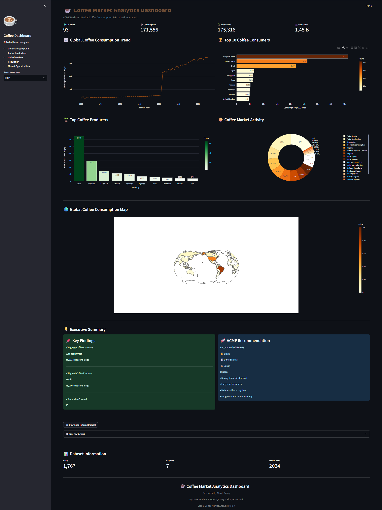
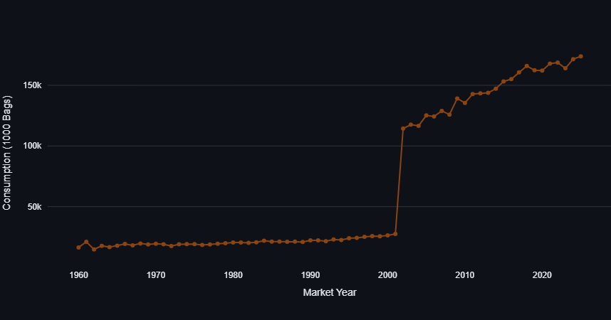
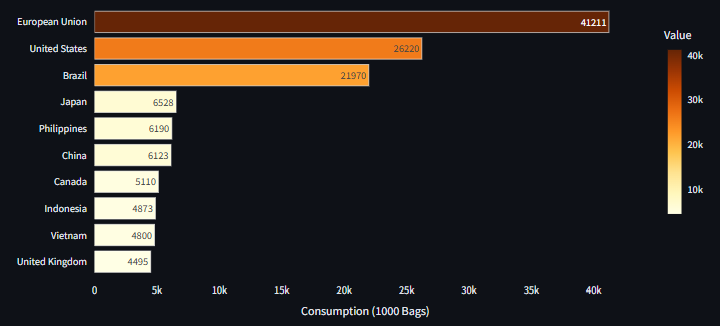
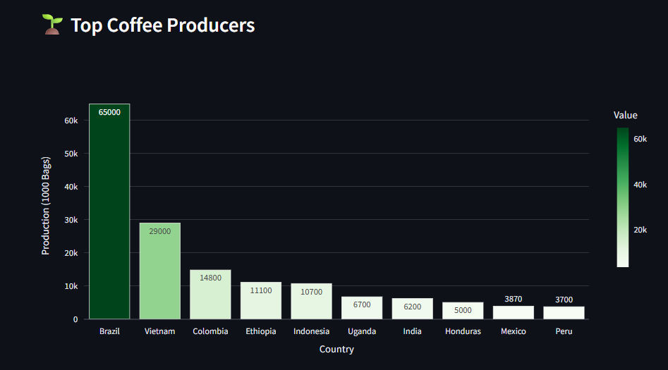
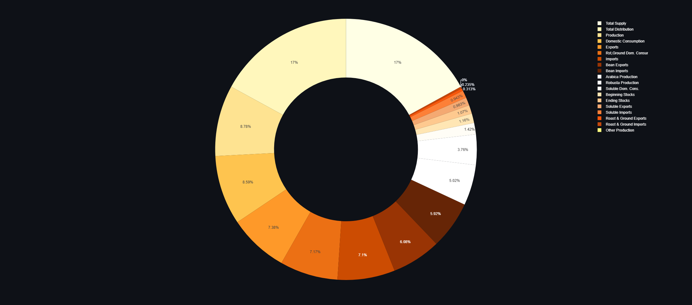
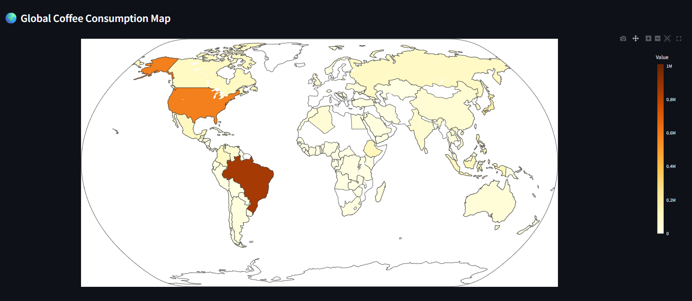
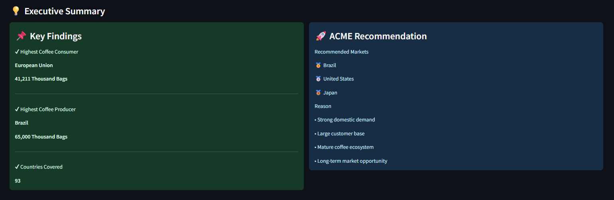

# ☕ Coffee Market Analytics Dashboard

<div align="center">


### End-to-End Coffee Market Analytics using Python, PostgreSQL, SQL, Streamlit & Plotly

Built as part of the **Nium Data Analytics Case Study Assignment**

</div>

---

# 📖 Table of Contents

- Project Overview
- Business Problem
- Dashboard Preview
- Features
- Tech Stack
- Project Structure
- Installation
- Dashboard Walkthrough
- Business Insights
- SQL Queries
- Database
- Reflection
- Future Improvements
- Dataset Limitation
- Author

---

# 📌 Project Overview

Coffee consumption continues to grow globally, creating opportunities for international coffee chains.

This project builds a complete analytics pipeline to help **ACME Baristas** identify the best markets for expansion using publicly available coffee production, consumption, population, and country datasets.

The project demonstrates an end-to-end analytics workflow including:

- Data Cleaning
- Data Integration
- PostgreSQL Database
- SQL Analytics
- Interactive Dashboard
- Business Recommendations

---

# 🎯 Business Problem

ACME Baristas plans to expand internationally.

The objective was to answer:

- Which 3 markets should ACME enter?
- Is this a good time to expand?
- What opportunities and risks exist?
- Which countries have the strongest coffee ecosystem?

---

# 📊 Dashboard Preview

## Dashboard Overview



---

## KPI Cards


---

## Global Coffee Consumption Trend



---

## Top Coffee Markets



---

## Top Coffee Producers



---

## Coffee Market Activity



---

## Global Consumption Map



---

## Executive Summary



---

# 🚀 Dashboard Features

✔ Interactive Streamlit Dashboard

✔ Year Filter

✔ KPI Cards

✔ Coffee Consumption Trend

✔ Top Coffee Consuming Countries

✔ Top Coffee Producing Countries

✔ Coffee Activity Distribution

✔ Global Coffee Consumption Map

✔ Business Insights

✔ CSV Download

✔ PostgreSQL Integration

✔ SQL Driven Analytics

---

# 🛠 Technology Stack

| Tool | Purpose |
|------|----------|
| Python | Data Cleaning & Processing |
| Pandas | Data Wrangling |
| PostgreSQL | Database |
| SQL | Data Transformation |
| Plotly | Interactive Visualizations |
| Streamlit | Dashboard |
| Git & GitHub | Version Control |

---

# 📂 Project Structure

```text
coffee-market-analytics/

├── dashboard/
│      app.py
│
├── data/
│      raw/
│      processed/
│
├── database/
│      coffee_market.sql
│
├── notebooks/
│      01_data_exploration.ipynb
│
├── sql/
│      01_market_summary.sql
│      02_top10_markets.sql
│      03_market_trends.sql
│
├── images/
│
├── requirements.txt
├── README.md
└── .gitignore
```

---

# ▶ Installation

Clone Repository

```bash
git clone https://github.com/itz-akash/coffee-market-analytics.git
```

Install Requirements

```bash
pip install -r requirements.txt
```

Run Dashboard

```bash
streamlit run dashboard/app.py
```

---

# 📈 Dashboard Walkthrough

The dashboard provides interactive insights into worldwide coffee markets.

It includes:

- Total Countries
- Domestic Consumption
- Production
- Population

along with

- Historical Consumption Trend
- Top Coffee Markets
- Coffee Production Analysis
- Market Distribution
- Global Consumption Map
- Executive Summary

Users can filter the dashboard by Market Year and download the filtered dataset.

---

# 💼 Business Recommendations

Based on the analysis, the recommended expansion markets are:

🥇 Brazil

🥈 United States

🥉 Japan

### Why?

- Large customer base
- Strong domestic coffee demand
- Mature coffee ecosystem
- Long-term market potential

---

# 📊 Key Insights

### Highest Coffee Consumer

European Union

41,211 Thousand Bags

---

### Highest Coffee Producer

Brazil

65,000 Thousand Bags

---

### Countries Covered

93 Countries

---

### Market Attributes

19 Coffee Market Indicators

---

# 🗄 PostgreSQL Database

The cleaned dataset was imported into PostgreSQL.

The repository includes:

```
database/
coffee_market.sql
```

allowing the database to be restored using pg_restore or pgAdmin.

---

# 📝 SQL Queries

Three SQL analytical queries are included.

- Market Summary

- Top 10 Coffee Markets

- Global Market Trends

Located inside:

```
sql/
```

---

# 📚 Datasets Used

- USDA Coffee Dataset
- World Bank Population Dataset
- Country Codes Dataset

---

# 💡 Challenges

- Standardizing country names
- Joining three independent datasets
- Missing country codes
- Handling missing values
- Creating a scalable PostgreSQL schema
- Building a responsive dashboard using Python only

---

# 📌 Assumptions

- Country names were standardized before merging.

- Latest available population values were used.

- Coffee consumption values are reported in Thousand Bags.

- Market recommendations are based on available historical data.

---

# 🚀 Future Improvements

Given additional time and richer datasets, the project could be extended with:

- Machine Learning Forecasting

- Demand Prediction

- Coffee Shop Density Analysis

- Revenue Forecasting

- Customer Segmentation

- Profitability Analysis

- Automated ETL Pipeline

---

# 📅 Dataset Limitation

The publicly available coffee dataset contains limited information beyond **2024**, with no complete market data for **2025**.

If comprehensive 2025 data had been available, additional analyses such as year-over-year growth, demand forecasting, market forecasting, and more impactful strategic recommendations could have been developed.

This limitation is due to the availability of the public source data rather than the implementation of the analytics solution.

---

# 📝 Reflection

## Design Choices

A modular analytics pipeline was created using Python for preprocessing, PostgreSQL for storage, SQL for transformations, and Streamlit for interactive visualization.

This approach improves scalability, maintainability, and reproducibility.

---

## Challenges

The biggest challenge was merging three datasets with inconsistent country names and codes.

Country standardization and data cleaning ensured accurate joins across all datasets.

---

## Additional Data That Would Improve Insights

- Coffee Prices

- GDP

- Inflation

- Coffee Shop Count

- Retail Sales

- Import Revenue

- Export Revenue

- Per Capita Coffee Consumption

These would enable stronger market opportunity analysis and forecasting.

---

# 👨‍💻 Author

## Akash Dubey

**Data Analyst**

Python • SQL • PostgreSQL • Streamlit • Plotly • Pandas

GitHub

https://github.com/itz-akash

---

⭐ If you found this project useful, consider giving it a star!
